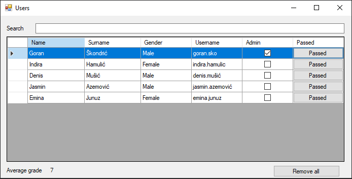
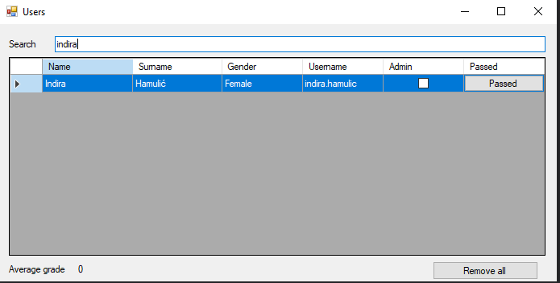
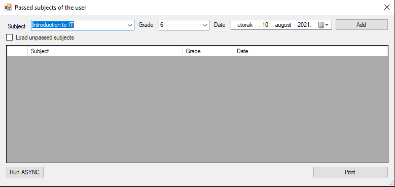
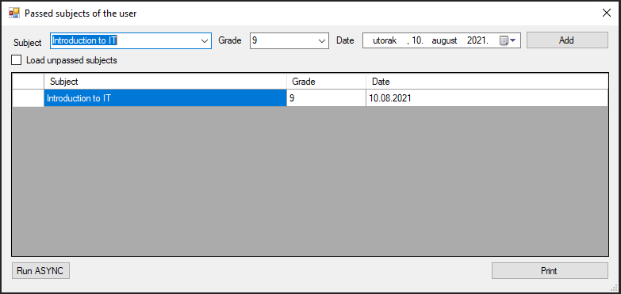
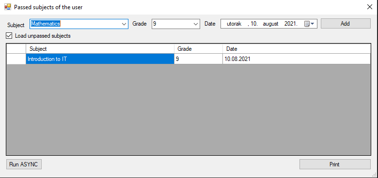
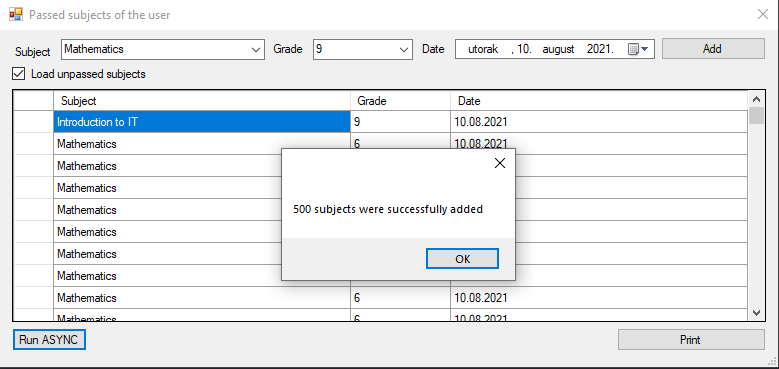
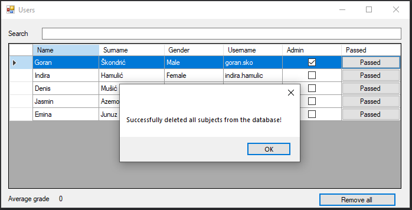
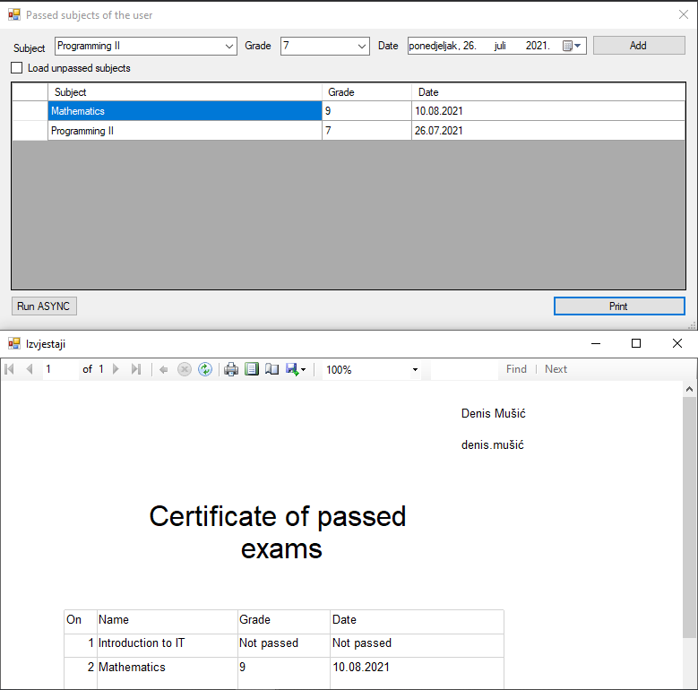

# E_system_school
E system school with grades and subjects

On the first image we have the main window form called "Users". In this form we have a table in which the students are arranged with their attributes such as name, surname, gender. In the lower left corner we have  the average grade of all students.

In the same form we have a search engine which filters data by name and surname. If we press the button "Passed" it will lead us to a another form called "Passed subject of the user".

Here we can add the subject that the student passed if we select that subject, grade, date and click "Add"

In this picture we see that the subject Introduction to IT has been added

In the left corner we have the check box called "Load unpassed subjects". If we check the box in tabele called "Subject" will be load only the subjects that the student didnt pass. In this case in the table will be Mathematicis and becouse Introduction to IT is already added.

If we press "Run ASYNC" the program will add 500 same subjects with same grade and date.

We can return to the home screen and delete all passed subjects for each student from the database
if we press the button "Reamove all"

Finally we have the button "Print". If we press the button we will make a report in the form of a certificate of passed student subjects.
